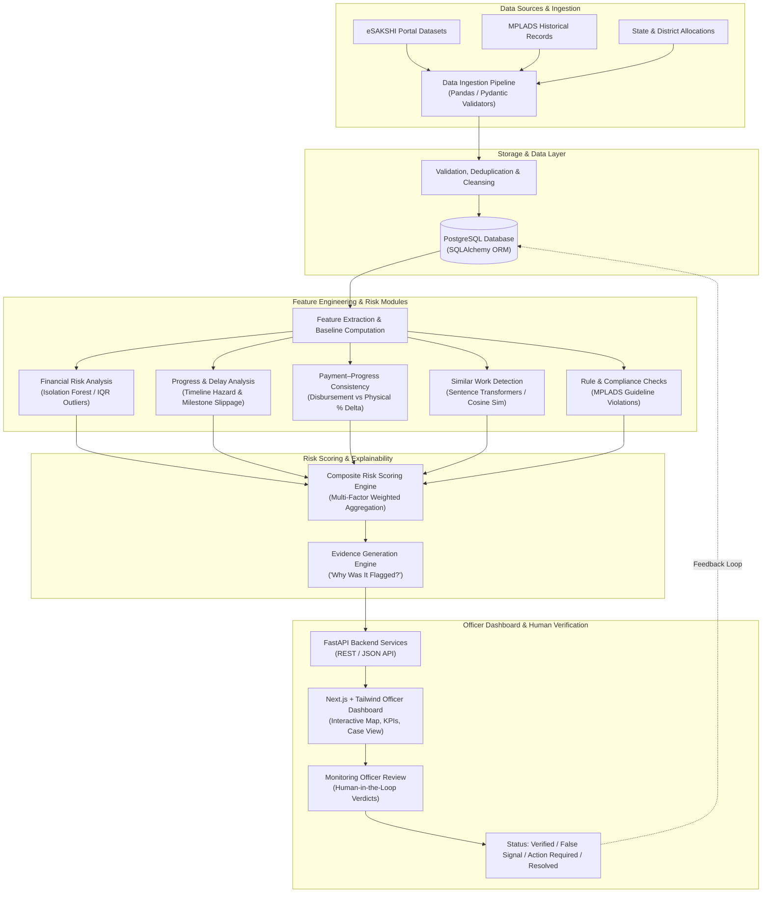

# Ledger Lens — System Architecture Document
**Problem Statement:** SIH26102 — Development of an AI-powered system to detect anomalies, fraud, and inefficiencies in MPLAD Scheme implementation.  
**System Name:** Ledger Lens (AI-Powered MPLADS Risk Intelligence & Monitoring Platform)  
**Positioning:** Decision-Support System for Monitoring Officers (Human-in-the-Loop)

---

## 1. High-Level Architectural Flow

```text
               MPLADS / eSAKSHI DATA
                        ↓
                  Data Ingestion
                        ↓
              Validation & Cleaning
                        ↓
              PostgreSQL Data Layer
                        ↓
               Feature Engineering
                        ↓
       ┌─────────────────────────────────────┐
       │ Financial Risk Analysis             │
       │ Progress & Delay Analysis           │
       │ Payment–Progress Consistency        │
       │ Similar Work Detection              │
       │ Rule/Compliance Checks              │
       └─────────────────────────────────────┘
                        ↓
                   Risk Engine
                        ↓
              Explainable Risk Score
                        ↓
         Evidence / "Why Was It Flagged?"
                        ↓
                Officer Dashboard
                        ↓
                Human Verification
                        ↓
 Verified / False Signal / Action Required / Resolved
```

---

## 2. Mermaid System Architecture Diagram



---

## 3. Core Architectural Principles

1. **Human-in-the-Loop Decision Support**:  
   Ledger Lens does **not** render automated fraud verdicts. The system acts as an intelligent triage engine that identifies risk signals, anomalies, and potential inefficiencies. The ultimate decision rests with the authorized monitoring officer.
2. **Explainability by Design**:  
   Every risk signal is accompanied by structured evidence explaining the root cause (e.g. *"Disbursement exceeded physical milestone by 45%"*, *"Work title shares 94% semantic similarity with Work #1042 sanctioned 3 months prior in the same ward"*).
3. **Data Provenance & Integrity**:  
   Raw data is immutable. All cleaning transformations, feature derivations, and risk computations are traceable with timestamps and versioned audit logs.
4. **Resilience to Incomplete Data**:  
   The modular architecture enables risk sub-engines to operate independently based on data availability (e.g., MP allocation outlier detection operates on macro tables, while NLP similarity operates when project descriptions exist).

---

## 4. Component Breakdown

### 4.1. Data Ingestion & Cleansing Layer
- **Ingestion Handlers:** Ingest CSV, Excel, and JSON exports from the eSAKSHI portal.
- **Validation Engine:** Built on **Pydantic v2**, enforcing schemas, data types, date formats, and geographic constraints.
- **Sanitization Pipeline:**
  - Removal of trailer rows (e.g., `'Grand Total'`).
  - Parsing currency formats (stripping symbols, handling Indian numerical comma groupings).
  - Normalizing MP names, state codes, and constituency strings.

### 4.2. PostgreSQL Data Layer
- **Relational Schema (SQLAlchemy ORM):**
  - `states`: Administrative divisions and aggregate budget limits.
  - `constituencies`: Lok Sabha parliamentary constituencies and reservation metadata.
  - `members_of_parliament`: MP demographic and allocation profiles.
  - `projects / works`: Granular work records, sectors, locations, and sanction values.
  - `milestones & payments`: Timeline stages, physical progress percentages, and payment records.
  - `risk_signals`: Computed anomaly signals, severity tiers, and evidence metadata.
  - `officer_reviews`: Human verification audit logs, officer remarks, and review statuses.

### 4.3. Feature Engineering & Risk Modules

#### Module 1: Financial Risk Analysis
- **Methodology:** Unsupervised outlier detection (**Isolation Forest**) combined with parametric statistical bounds (Z-score and IQR).
- **Target Signals:** Unusual allocation amounts, rapid budget depletion, uncharacteristic cost spikes per work category.

#### Module 2: Progress & Delay Analysis
- **Methodology:** Timeline velocity analysis, milestone duration distribution modeling.
- **Target Signals:** Prolonged stalling after administrative sanction, completion date overruns exceeding normal thresholds.

#### Module 3: Payment–Progress Consistency
- **Methodology:** Financial disbursement vs. physical execution delta tracking ($Delta = \% \text{Disbursed} - \% \text{Completed}$).
- **Target Signals:** Premature fund release before milestone verification, front-loaded disbursements with zero progress.

#### Module 4: Similar Work Detection (NLP)
- **Methodology:** Dense semantic embeddings via **Sentence Transformers** (`all-MiniLM-L6-v2`) combined with Cosine Similarity and location proximity.
- **Target Signals:** Duplicate work proposals, repetitive descriptions across adjacent financial years, identical project scopes submitted under different IDs.

#### Module 5: Rule-Based Compliance Engine
- **Methodology:** Deterministic heuristic rules matching official MPLADS guidelines.
- **Target Signals:** Works sanctioned beyond statutory expenditure ceilings, prohibited asset categories, missing statutory approvals.

### 4.4. Risk Scoring & Explainability Engine
- Aggregates module outputs into a calibrated composite **Risk Score** ($0 - 100$).
- Risk Tiers:
  - `LOW` (0–29): Normal project lifecycle parameters.
  - `MEDIUM` (30–69): Noticeable variances requiring routine desk review.
  - `HIGH` (70–100): Critical anomalies requiring prioritized physical verification.
- Generates transparent, human-readable **Evidence Cards** highlighting contributing risk factors.

### 4.5. FastAPI Backend Layer
- High-performance asynchronous Python API exposing endpoints:
  - `GET /api/v1/overview`: National & state-level summary metrics.
  - `GET /api/v1/mps`: MP list, allocation distributions, and risk flags.
  - `GET /api/v1/projects`: Granular project explorer with filtering and search.
  - `GET /api/v1/projects/{id}/risk`: Detailed risk score breakdown and evidence trail.
  - `POST /api/v1/reviews`: Submission of officer verification decisions.

### 4.6. Next.js Frontend Dashboard
- Modern, responsive administrative interface built with **Next.js**, **TypeScript**, and **Tailwind CSS**.
- **Key Modules:**
  - Executive Overview (Disparities, Outliers, National Map).
  - Triage & Alert Inbox (Prioritized high-risk projects).
  - Project Deep Dive & Evidence Timeline.
  - Verification & Case Management Modal (`Verified`, `False Signal`, `Action Required`, `Resolved`).

---

## 5. Technology Stack Summary

| Layer | Technologies |
| :--- | :--- |
| **Frontend** | Next.js (App Router), TypeScript, Tailwind CSS, Recharts, Lucide Icons, Leaflet (Map Visualizations) |
| **Backend API** | Python 3.11+, FastAPI, Pydantic v2, Uvicorn |
| **Database & ORM** | PostgreSQL, SQLAlchemy 2.0, Alembic |
| **Data & ML** | Pandas, NumPy, Scikit-learn (Isolation Forest), Sentence-Transformers, PyTorch |
| **Document / OCR** | PyPDF, Tesseract / Vision APIs (Phase 6) |
| **Testing** | Pytest, Jest / React Testing Library |
